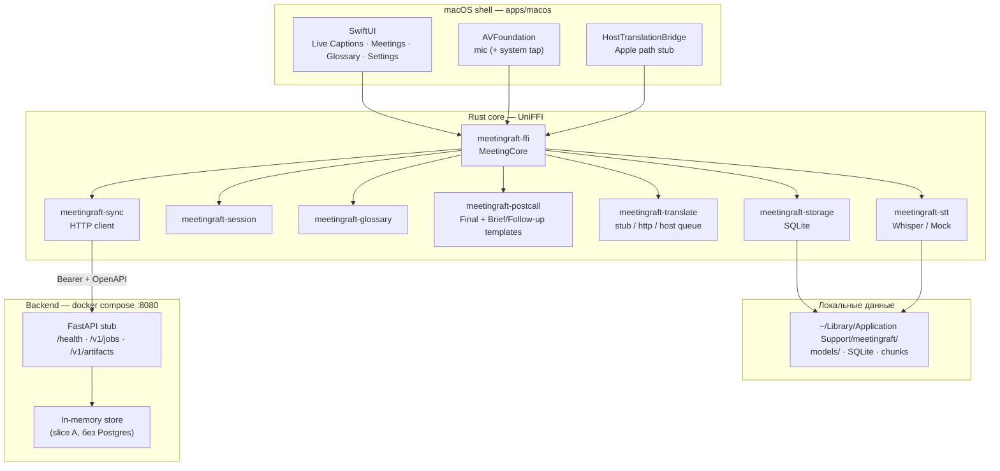
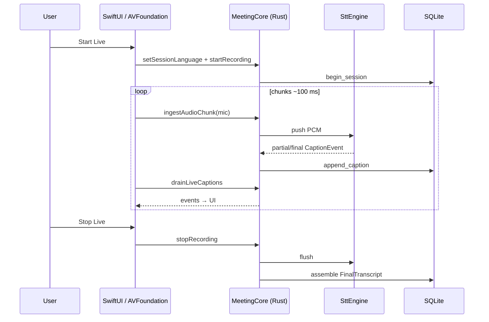
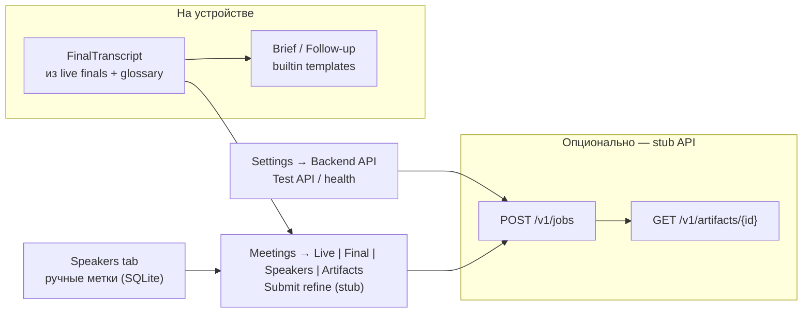

# MeetingRaft — архитектура (схемы) и установка

Документ для онбординга: как устроен стек сейчас и как поднять прототип
локально. Детали решений — в [architecture.md](architecture.md) и ADR в
`docs/adr/`.

**Статус прототипа (2026-08):** Phase 0–6 local MVP + ADR-007 **slice A**
(FastAPI stub jobs) + **Speakers skeleton** (ручные метки в Meetings).
WhisperX / diarization / production LLM — ещё не в рантайме.

---

## 1. Отрисованная архитектура

### 1.1 Слои (runtime)



### 1.2 Live-сессия (Stage 1)



### 1.3 Post-call и backend (Stage 2 сейчас)



**Provenance (Meetings UI):** Live ≠ вход для Brief; Brief/Follow-up ← **Final**.

### 1.4 Карта репозитория

```text
meetingraft/
├─ apps/macos/          SwiftUI + Generated UniFFI + Scripts/
├─ rust/crates/         domain, session, stt, glossary, postcall,
│                       translate, sync, storage, ffi
├─ backend/             FastAPI stub (uv + pytest)
├─ shared/openapi.yaml  контракт ADR-007
├─ docker-compose.yml   api:8080
└─ docs/                ADR, roadmap, этот файл
```

---

## 2. Процедура установки (потенциальный / текущий прототип)

### 2.1 Требования

| Компонент | Минимум |
|-----------|---------|
| OS | macOS 15+ (Apple Silicon предпочтительно для Whisper Metal) |
| Xcode | 16+ с Command Line Tools |
| Rust | stable (`rustup`) |
| Прочее | [XcodeGen](https://github.com/yonaskolb/XcodeGen), опционально [SwiftFormat](https://github.com/nicklockwood/SwiftFormat) |
| Backend (опц.) | Docker Desktop **или** Python 3.13 + [uv](https://github.com/astral-sh/uv) |
| Whisper (опц.) | `curl` / `hf` CLI для ggml с Hugging Face |

### 2.2 Клонирование

```bash
git clone https://github.com/Vitvitsky/meetingraft.git
cd meetingraft
git checkout main   # или feature-ветка
```

### 2.3 Rust + UniFFI + macOS app

```bash
# 1) FFI dylib + Swift bindings + Xcode project
apps/macos/Scripts/generate-ffi.sh
# по умолчанию включает --features whisper; для CI без Metal:
# MEETINGRAFT_FFI_FEATURES= apps/macos/Scripts/generate-ffi.sh

# 2) Открыть в Xcode
open apps/macos/MeetingRaft.xcodeproj
# ⌘R — Run

# или CLI
cd apps/macos
xcodebuild -project MeetingRaft.xcodeproj -scheme MeetingRaft \
  -configuration Debug build CODE_SIGNING_ALLOWED=NO
```

Данные приложения:
`~/Library/Application Support/meetingraft/`

### 2.4 Модель Whisper (live STT)

Без файла модели используется **Mock** STT.

```bash
# dev (~base)
apps/macos/Scripts/download-stt-model.sh

# prod-ориентир
MODEL=large-v3-turbo apps/macos/Scripts/download-stt-model.sh

# затем пересобрать FFI с whisper (скрипт по умолчанию уже так делает)
apps/macos/Scripts/generate-ffi.sh
```

Файлы: `…/meetingraft/models/ggml-*.bin` (Hugging Face `ggerganov/whisper.cpp`).

### 2.5 Backend stub (опционально)

```bash
# Docker
docker compose up --build
# API: http://127.0.0.1:8080
# Token: dev-token

# или локально без Docker
cd backend
uv sync --extra dev
MEETINGRAFT_API_TOKEN=dev-token uv run uvicorn app.main:app --port 8080
```

В приложении: **Settings → Backend API**
- Base URL: `http://127.0.0.1:8080`
- Bearer: `dev-token`
- кнопка **Test API** → `GET /health`

**Settings → Providers → LLM = Backend:** Generate Brief / Follow-up в Meetings
отправляет `POST /v1/jobs` с `kind: brief` или `follow_up`, затем poll job и
`GET /v1/artifacts/{id}`; при ошибке backend — явная ошибка (без fallback на
builtin templates).

Контракт: [`shared/openapi.yaml`](../shared/openapi.yaml).

### 2.6 Проверка тестами

```bash
# Rust
cd rust && cargo test && cargo fmt --check && cargo clippy --all-targets -- -D warnings

# Backend
cd backend && uv sync --extra dev && uv run ruff check app tests && uv run pytest

# macOS
cd apps/macos && xcodegen generate
xcodebuild -project MeetingRaft.xcodeproj -scheme MeetingRaft \
  -configuration Debug test CODE_SIGNING_ALLOWED=NO
```

CI: `.github/workflows/ci.yml` (rust + macos + backend).

Локально перед push: `pre-commit install` (один раз) и/или
`pre-commit run --all-files` — см. `.pre-commit-config.yaml` и `AGENTS.md`.

### 2.7 Минимальный smoke после установки

1. Запустить app → **Start Captions** (demo) — появляются строки.
2. Сменить Language → English → снова demo — английский скрипт.
3. (Опц.) Whisper model + **Start Live** — captions / Mock.
4. Stop Live → **Meetings** → Final / **Speakers** (Add, rename, delete) / Generate Brief.
5. (Опц.) `docker compose up` → Settings **Test API** = OK.
6. (Опц.) Settings **LLM = Backend** → **Meetings** → Final → **Generate Brief** → markdown из stub job (`kind: brief`).
7. (Опц.) **Meetings** → **Artifacts** → **Submit refine (stub)** → refine markdown из backend.

### 2.8 Потенциальная «продакшен»-инсталляция (ещё не автоматизирована)

Целевое направление (не реализовано end-to-end):

1. Подписанный / notarized `.app` (Phase 7).
2. First-run download ggml в Application Support.
3. Backend на домашнем сервере: полный ADR-007 (Postgres, Redis, Dramatiq, MinIO, WhisperX).
4. Token в Keychain; `apiBaseUrl` на HTTPS.
5. Опционально: NLLB translate worker, Ollama/Gemma для Brief.

Пока используйте §2.3–2.7 как единственную поддерживаемую процедуру.

---

## 3. Связанные документы

| Документ | Содержание |
|----------|------------|
| [architecture.md](architecture.md) | Принципы, latency, privacy |
| [roadmap.md](roadmap.md) | Фазы 0–7 |
| [backlog.md](backlog.md) | Эпики |
| [adr/](adr/) | ADR-001…008 |
| [../AGENTS.md](../AGENTS.md) | Команды агентов / границы слоёв |
| [../README.md](../README.md) | Короткий обзор репо |
