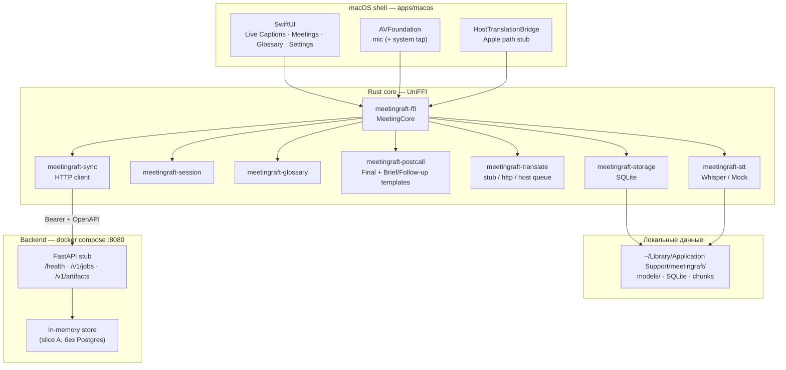
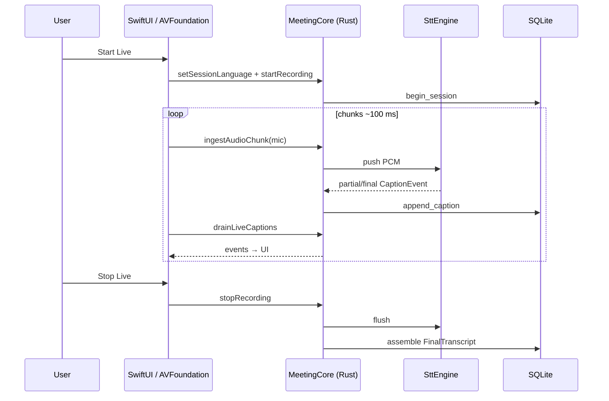
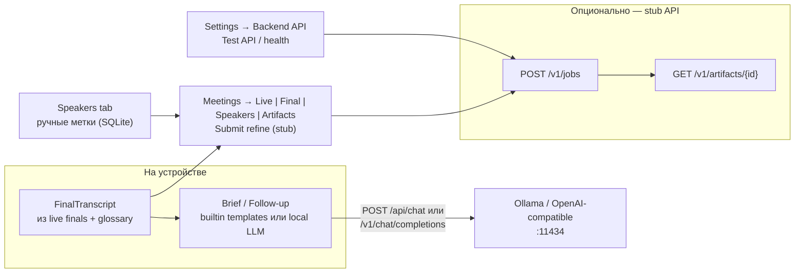

# MeetingRaft — архитектура (схемы) и установка

Документ для онбординга: как устроен стек сейчас и как поднять прототип
локально. Детали решений — в [architecture.md](architecture.md) и ADR в
`docs/adr/`.

**Статус прототипа (2026-08):** Phase 0–6 local MVP + ADR-007 **slice A**
(FastAPI jobs; optional OpenAI-compat LLM via `LLM_*` или JSON-реестр +
`GET /v1/models`) + **Speakers skeleton** + локальные LLM (Ollama /
OpenAI-compatible). WhisperX / diarization — ещё не в рантайме; provider
registry — **partial** (static JSON + models API, без CRUD/billing).

---

## 1. Отрисованная архитектура

### 1.1 Слои (runtime)



### 1.2 Live-сессия (Stage 1)



### 1.3 Post-call и backend (Stage 2 сейчас)



**Provenance (Meetings UI):** Live ≠ вход для Brief; Brief/Follow-up ← **Final**.

### 1.4 Карта репозитория

```text
meetingraft/
├─ apps/macos/          SwiftUI + Generated UniFFI + Scripts/
├─ rust/crates/         domain, session, stt, glossary, postcall,
│                       translate, sync, storage, ffi
├─ backend/             FastAPI stub (uv + pytest)
├─ shared/openapi.yaml  контракт ADR-007
├─ docker-compose.yml   api:8080
└─ docs/                ADR, roadmap, этот файл
```

---

## 2. Процедура установки (потенциальный / текущий прототип)

### 2.1 Требования

| Компонент | Минимум |
|-----------|---------|
| OS | macOS 15+ (Apple Silicon предпочтительно для Whisper Metal) |
| Xcode | 16+ с Command Line Tools |
| Rust | stable (`rustup`) |
| Прочее | [XcodeGen](https://github.com/yonaskolb/XcodeGen), опционально [SwiftFormat](https://github.com/nicklockwood/SwiftFormat) |
| Backend (опц.) | Docker Desktop **или** Python 3.13 + [uv](https://github.com/astral-sh/uv) |
| Whisper (опц.) | `curl` / `hf` CLI для ggml с Hugging Face |

### 2.2 Клонирование

```bash
git clone https://github.com/Vitvitsky/meetingraft.git
cd meetingraft
git checkout main   # или feature-ветка
```

### 2.3 Rust + UniFFI + macOS app

```bash
# 1) FFI dylib + Swift bindings + Xcode project
apps/macos/Scripts/generate-ffi.sh
# по умолчанию включает --features whisper; для CI без Metal:
# MEETINGRAFT_FFI_FEATURES= apps/macos/Scripts/generate-ffi.sh

# 2) Открыть в Xcode
open apps/macos/MeetingRaft.xcodeproj
# ⌘R — Run

# или CLI
cd apps/macos
xcodebuild -project MeetingRaft.xcodeproj -scheme MeetingRaft \
  -configuration Debug build CODE_SIGNING_ALLOWED=NO
```

Данные приложения:
`~/Library/Application Support/meetingraft/`

### 2.4 Модель Whisper (live STT)

Без файла модели используется **Mock** STT.

**Settings → Live STT (ADR-005):** picker `auto | base | small | large-v3-turbo`;
кнопка **Download** тянет ggml с Hugging Face (`ggerganov/whisper.cpp/resolve/main/…`)
в `modelsDirectory()` (обычно `~/Library/Application Support/meetingraft/models/`).
При первом открытии Settings, если каталог пуст — автоматически качается
**`ggml-base.bin`**. Выбор сохраняется через UniFFI `setPreferredWhisperModel`;
Rust `resolve_whisper_model` подставляет файл для Live STT (при сборке с
`--features whisper`).

| id | файл |
|----|------|
| `auto` | приоритетный список (как раньше) |
| `base` | `ggml-base.bin` |
| `small` | `ggml-small.bin` |
| `large-v3-turbo` | `ggml-large-v3-turbo.bin` |

CLI-альтернатива (CI / headless):

```bash
# dev (~base)
apps/macos/Scripts/download-stt-model.sh

# prod-ориентир
MODEL=large-v3-turbo apps/macos/Scripts/download-stt-model.sh

# затем пересобрать FFI с whisper (скрипт по умолчанию уже так делает)
apps/macos/Scripts/generate-ffi.sh
```

Файлы: `…/meetingraft/models/ggml-*.bin` (Hugging Face `ggerganov/whisper.cpp`).

<a id="backend-setup"></a>

### 2.5 Backend stub — настройка (опционально)

Сейчас это **ADR-007 slice A**: FastAPI in-memory jobs без Postgres / Redis /
WhisperX. `refine` (и `brief`/`follow_up` без LLM-конфига) — stub markdown.
Jobs `brief`/`follow_up` вызывают OpenAI-compatible провайдер из **JSON-реестра**
(`PROVIDERS_JSON` / `LLM_PROVIDERS_FILE`) или, если реестра нет, из compat
`LLM_*` (синтетический провайдер `id=default`). Каталог моделей отдаёт
`GET /v1/models` (ключи и `base_url` провайдеров в ответ не попадают).
Контракт: [`shared/openapi.yaml`](../shared/openapi.yaml).

#### Шаг 1. Поднять API

Из корня репозитория:

```bash
# Вариант A — Docker (рекомендуется)
# без LLM — только stub jobs:
docker compose up --build

# с одним LLM (compat LLM_* → provider default):
export LLM_BASE_URL=http://93.189.243.223:58001   # без /v1
export LLM_API_KEY=LOCAL-API-KEY
export LLM_MODEL=Google/gemma-4-12b-it
docker compose up --build

# с реестром нескольких провайдеров (inline JSON):
export PROVIDERS_JSON='{"providers":[{"id":"home-llm","base_url":"http://93.189.243.223:58001","api_key":"LOCAL-API-KEY","default_model":"Google/gemma-4-12b-it","models":[{"id":"Google/gemma-4-12b-it","display_name":"Gemma 4 12B"},{"id":"Qwen/Qwen3-32B","display_name":"Qwen3 32B"}]}]}'
docker compose up --build
# слушает http://127.0.0.1:8080
# MEETINGRAFT_API_TOKEN=dev-token (см. docker-compose.yml)
```

Пример файла реестра (альтернатива inline — `LLM_PROVIDERS_FILE`):

```json
{
  "providers": [
    {
      "id": "home-llm",
      "base_url": "http://93.189.243.223:58001",
      "api_key": "LOCAL-API-KEY",
      "default_model": "Google/gemma-4-12b-it",
      "models": [
        { "id": "Google/gemma-4-12b-it", "display_name": "Gemma 4 12B" },
        { "id": "Qwen/Qwen3-32B", "display_name": "Qwen3 32B" }
      ]
    }
  ]
}
```

При валидном реестре `LLM_*` **игнорируются**. Невалидный JSON / дубликаты
`provider.id` — backend не стартует (fail-fast при lifespan: `load_registry()`).
Handlers читают env на каждый запрос (удобно для тестов); смена
`PROVIDERS_JSON` mid-process без рестарта может разойтись со startup-check —
для stub допустимо, в проде меняйте env и перезапускайте процесс.

```bash
# Вариант B — локально через uv
cd backend
uv sync --extra dev
MEETINGRAFT_API_TOKEN=dev-token \
PROVIDERS_JSON='{"providers":[{"id":"home-llm","base_url":"http://93.189.243.223:58001","api_key":"LOCAL-API-KEY","default_model":"Google/gemma-4-12b-it","models":[{"id":"Google/gemma-4-12b-it"}]}]}' \
  uv run uvicorn app.main:app --host 127.0.0.1 --port 8080
# compat без реестра: LLM_BASE_URL=... LLM_API_KEY=... LLM_MODEL=...
```

Проверка без приложения:

```bash
curl -s http://127.0.0.1:8080/health
# {"status":"ok"}

curl -s -H "Authorization: Bearer dev-token" http://127.0.0.1:8080/v1/models
# {"models":[{"provider_id":"home-llm","model":"...","display_name":"..."}]}

curl -s -o /dev/null -w "%{http_code}\n" \
  -H "Authorization: Bearer dev-token" \
  -H "Content-Type: application/json" \
  -d '{"meeting_id":"m1","kind":"brief","primary_language":"ru","allowed_languages":["ru"]}' \
  http://127.0.0.1:8080/v1/jobs
# 201
```

| Параметр | Значение по умолчанию | Где задаётся |
|----------|------------------------|--------------|
| URL | `http://127.0.0.1:8080` | порт compose / uvicorn |
| Bearer token | `dev-token` | `MEETINGRAFT_API_TOKEN` |
| Auth | HTTP Bearer | на все `/v1/*`; `/health` без токена |
| `PROVIDERS_JSON` | пусто | inline JSON реестра (приоритет) |
| `LLM_PROVIDERS_FILE` | пусто | путь к JSON-файлу, если `PROVIDERS_JSON` пуст |
| `LLM_BASE_URL` | пусто | compat: один провайдер `default`, **без** `/v1`; только если реестра нет |
| `LLM_API_KEY` | пусто | compat: ключ для `default` |
| `LLM_MODEL` | пусто | compat: `default_model` и единственная модель в каталоге |

Смена токена MeetingRaft API: тот же `MEETINGRAFT_API_TOKEN` в окружении API
**и** в Settings приложения (иначе 401). Секреты LLM провайдера (`api_key`,
`base_url`) — **только** в env backend / JSON-реестре, не во фронте и не в
`GET /v1/models`.

#### Шаг 2. Прописать в приложении

**Settings → Backend API (ADR-007)** (дефолты уже совпадают со stub):

| Поле | Значение для local stub |
|------|-------------------------|
| API base URL | `http://127.0.0.1:8080` |
| Bearer token | `dev-token` |

Нажать **Test API** → должно стать **OK** (`GET /health` через UniFFI sync).

Замечания:

- Значения живут в `ProviderSettingsStore` (сессия UI); после перезапуска app
  снова подставятся дефолты `8080` / `dev-token`, пока нет Keychain persistence.
- Перед Generate / Submit refine shell передаёт URL+token в Rust через
  `setApiConfig` (`applyProviderConfig` на экране встречи / onChange в Settings).

#### Шаг 3. Что включать в Providers

Backend URL нужен для двух сценариев (не путать с локальным Ollama §2.6).

**Порядок для LLM = Backend:**

1. **Settings → Backend API** — URL + token → **Test API** = OK.
2. **Settings → Providers → LLM** — Engine: **Backend LLM**.
3. **Обновить** — app вызывает `GET /v1/models` и заполняет picker
   `(provider_id, model)`; при пустом каталоге Generate disabled.
4. **Meetings** → Final → **Generate Brief** / **Generate Follow-up**.

Детали:

1. **LLM = Backend** (**Settings → Providers → LLM**)
   - Engine: **Backend LLM**
   - Picker **Model** (не free-text): пара `provider_id` + `model` из каталога
   - Language-aware `system`/`user` собирает Rust (`brief_prompts` /
     `follow_up_prompts`) и кладёт в job `payload` вместе с `provider_id` и
     `model`; backend резолвит провайдера и вызывает
     `POST {base_url}/v1/chat/completions`
   - Meetings: **Generate Brief** / **Generate Follow-up** → jobs → артефакт
     `backend.brief` / `backend.follow_up`; banner показывает
     `backend · {provider_id}/{model}`
   - Без LLM-конфига на сервере — stub markdown; с LLM и ошибкой провайдера —
     job `failed`, **без** silent stub и без fallback на templates

2. **Artifacts → Submit refine (stub)**
   Тот же API, `kind: refine` (пока всегда stub). Нужен Backend API + Final.

`builtin_templates` / `ollama` / `openai_compat` **не** ходят в этот FastAPI
для Brief/Follow-up (локальные пути — §2.6).

#### Типичные ошибки

| Симптом | Что проверить |
|---------|----------------|
| Test API = Fail | `docker compose` / uvicorn запущен; URL без trailing slash; порт 8080 |
| 401 / invalid token | токен в Settings == `MEETINGRAFT_API_TOKEN` на сервере |
| «Нет моделей» / пустой picker | `PROVIDERS_JSON` / `LLM_PROVIDERS_FILE` или compat `LLM_*`; **Обновить** |
| Generate Brief → stub `# Stub brief` | задан ли реестр или `LLM_BASE_URL` на backend |
| Generate Brief ошибка / failed job | `api_key`, выбранная модель, `provider_id`; Final есть |
| 401 от LLM | ключ в реестре / `LLM_API_KEY`, не в Settings Bearer MeetingRaft |
| Backend не стартует | JSON реестра: синтаксис, уникальность `provider.id` и model id |
| Путаница с Ollama | Ollama — §2.6 (`:11434`); jobs API — `:8080` |

### 2.6 Локальный LLM: Ollama / OpenAI-compatible (опционально)

```bash
brew install ollama
ollama serve
# в другом terminal
ollama pull gemma2
```

В **Settings → Providers → LLM**:

- **Ollama:** Base URL `http://127.0.0.1:11434`, Model id `gemma2`;
  приложение вызывает `POST /api/chat`.
- **OpenAI-compatible:** тот же Base URL и Model id для Ollama либо адрес
  другого совместимого сервера; приложение вызывает
  `POST /v1/chat/completions`.

Затем открыть завершённую встречу с Final transcript и нажать
**Generate Brief** или **Generate Follow-up**. Ошибка локального LLM
показывается явно: fallback на builtin templates не выполняется.

### 2.6.1 Экспорт в Markdown (Obsidian)

В **Settings → Export** задайте папку (по умолчанию `~/Documents/MeetingRaft`).
На экране встречи с Final нажмите **Export to Markdown** — создаются до трёх
файлов `{yyyy-MM-dd}-{shortId}-{final|brief|follow-up}.md` (перезапись при
повторе). **Choose folder…** на экспорте обновляет путь в Settings. Для vault
Obsidian укажите путь к vault или подпапке; HTTP API и community plugin —
в backlog (§ Epic 8 в `backlog.md`).

### 2.7 Проверка тестами

Проверки — **локально** (автозапуск GitHub Actions отключён; workflow только
`workflow_dispatch` в `.github/workflows/ci.yml`):

```bash
# Rust
cd rust && cargo test && cargo fmt --check && cargo clippy --all-targets -- -D warnings

# Backend
cd backend && uv sync --extra dev && uv run ruff check app tests && uv run pytest

# macOS
cd apps/macos && xcodegen generate
xcodebuild -project MeetingRaft.xcodeproj -scheme MeetingRaft \
  -configuration Debug test CODE_SIGNING_ALLOWED=NO
```

Локально перед push: `pre-commit install` (один раз) и/или
`pre-commit run --all-files` — см. `.pre-commit-config.yaml` и `AGENTS.md`.

### 2.8 Минимальный smoke после установки

1. Запустить app → **Start Captions** (demo) — появляются строки.
2. Сменить Language → English → снова demo — английский скрипт.
3. (Опц.) Whisper model + **Start Live** — captions / Mock.
4. Stop Live → **Meetings** → Final / **Speakers** (Add, rename, delete) / Generate Brief.
5. (Опц.) Backend по §2.5: `docker compose up` → Settings **Test API** = OK.
6. (Опц.) Settings **LLM = Backend** → **Обновить** (models) → **Meetings** → Final → **Generate Brief** → markdown из stub или LLM job.
7. (Опц.) Запустить Ollama с моделью → Settings **LLM = Ollama**, URL
   `http://127.0.0.1:11434`, model id → **Generate Brief**; затем выбрать
   **OpenAI-compatible** с тем же URL и повторить.
8. (Опц.) **Meetings** → **Artifacts** → **Submit refine (stub)** → refine markdown из backend (§2.5 шаг 3).
9. (Опц.) **Settings → Export** → папка vault → встреча с Final → **Export to Markdown** (§2.6.1).

### 2.9 Потенциальная «продакшен»-инсталляция (ещё не автоматизирована)

Целевое направление (не реализовано end-to-end):

1. Подписанный / notarized `.app` (Phase 7).
2. First-run download ggml в Application Support.
3. Backend на домашнем сервере: полный ADR-007 (Postgres, Redis, Dramatiq, MinIO, WhisperX).
4. Token в Keychain; `apiBaseUrl` на HTTPS.
5. Опционально: NLLB translate worker и production LLM worker для Brief.

Пока используйте §2.3–2.8 как единственную поддерживаемую процедуру.

---

## 3. Связанные документы

| Документ | Содержание |
|----------|------------|
| [architecture.md](architecture.md) | Принципы, latency, privacy |
| [roadmap.md](roadmap.md) | Фазы 0–7 |
| [backlog.md](backlog.md) | Эпики |
| [adr/](adr/) | ADR-001…008 |
| [../AGENTS.md](../AGENTS.md) | Команды агентов / границы слоёв |
| [../README.md](../README.md) | Короткий обзор репо |
| [../shared/openapi.yaml](../shared/openapi.yaml) | Контракт backend jobs (ADR-007) |
| §2.5 выше | Пошаговая настройка backend stub в Settings |
