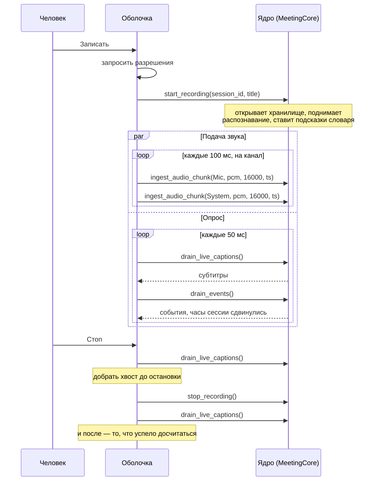

# Как оболочка разговаривает с ядром

Три вещи, которые не видны из сигнатур методов и на которых легко обжечься: взаимодействие построено на опросе, опрос не только читает, а внутри всё под одним замком.

Документ выведен из кода: `rust/crates/ffi/src/lib.rs` и `apps/macos/Sources/LiveCaptions/LiveCaptionsViewModel.swift`.

## Опрос, а не подписка

На границе **74 метода и ни одного колбэка**. Ядро никого ни о чём не уведомляет — оболочка сама приходит и забирает.

| Метод | Что отдаёт |
|---|---|
| `drain_events()` | События сессии; **двигает часы сессии**, см. ниже |
| `drain_live_captions()` | Накопленные живые субтитры, буфер очищается |
| `drain_live_translations()` | Поток перевода, пусто если выключен |
| `drain_host_translation_requests()` | Запросы к переводчику платформы |

macOS-оболочка опрашивает раз в 50 мс, пока идёт запись (`LiveCaptionsViewModel.swift:105`). Число взято из требования к задержке живых субтитров: неустойчивая часть реплики должна появляться не позже 2 секунд после произнесения (`docs/architecture.md`, раздел про бюджеты).

Если проектируете под событийную модель — её придётся строить у себя поверх опроса. Менять границу ради этого не надо: она общая с macOS-версией.

## Опрос двигает состояние

`drain_events()` — не чтение. Внутри он вызывает `session.push_tick(elapsed_ms)`, то есть **продвигает часы сессии**. Перестали опрашивать — сессия перестала идти.

Это неочевидно и нигде, кроме этого документа, не записано. Из названия метода следует обратное.

Практически: опрос нельзя останавливать, пока идёт запись, — ни при сворачивании окна, ни при уходе экрана из видимости, ни ради экономии. Останавливать его следует ровно тогда, когда останавливается запись.

## Один замок на всё ядро

Каждый метод границы начинается с `self.inner.lock()`. Замок один на весь `MeetingCore`, поэтому любые два вызова с разных потоков ждут друг друга.

**Главное следствие: `ingest_audio_chunk` внутри замка синхронно гоняет распознавание.** Не откладывает, не ставит в очередь — считает прямо там. Вызов может занять сотни миллисекунд.

Отсюда два правила:

**Никогда не звать `ingest_audio_chunk` из потока реального времени.** Аудио-колбэк должен положить данные в свой буфер и вернуться немедленно. Отдавать их ядру — с отдельного потока. На macOS так и сделано: tap складывает сэмплы, а в ядро они уходят из координатора записи.

**Опрос и подача звука конкурируют за один замок.** Опрос раз в 50 мс с потока интерфейса будет иногда ждать окончания распознавания. Это заложено в конструкцию; закладывайтесь на то, что вызов границы может занять заметное время, и не делайте его в обработчике, который обязан вернуться быстро.

## Жизненный цикл записи

Обратите внимание на добор хвоста вокруг `stop_recording`: на macOS `drain_live_captions` зовётся до остановки и ещё раз после (`LiveCaptionsViewModel.swift:110-115`). Без этого последние реплики встречи теряются — они досчитываются уже после команды «стоп».

## Ошибки

Методы границы возвращают **строку**: пустая — успех, непустая — текст ошибки. Исключений типа `Result` через границу нет.

Это соглашение всего файла, не частный случай. Пустую строку надо проверять; молча проглоченная ошибка здесь означает потерянную запись.

Часть читающих методов при ошибке отдаёт пустой список вместо сообщения — тогда отличить «ничего нет» от «не прочиталось» нельзя. Если такое место окажется на вашем пути и цена ошибки высока, это повод поправить границу, а не обходить.
